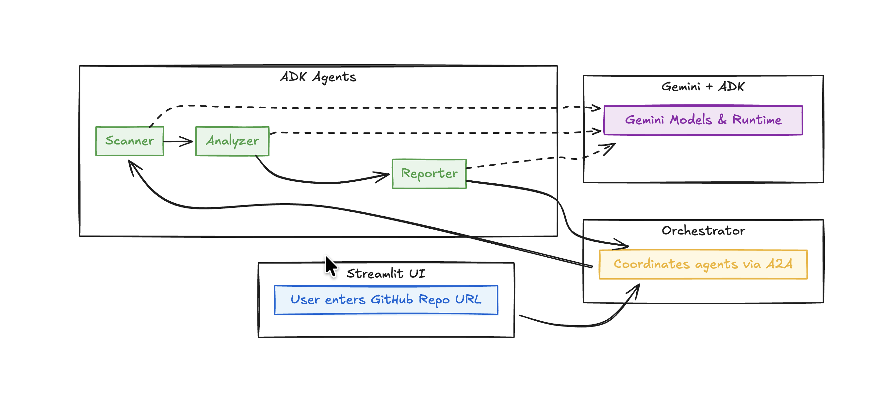

# GDG Workshop: Securing Your Codebase with ADK & A2A

This repo contains the code for a live workshop demo:
a **3-agent system** that scans a GitHub repo for security issues using:

- **Google Agent Development Kit (ADK)** – to define agents
- **Agent2Agent (A2A)** – to expose agents as interoperable services
- **Gemini** – to analyze code & configs and generate reports
- **gitingest** – to ingest entire GitHub repositories without cloning
- **Streamlit** – for a small web UI

Agents:

- `scanner_agent`: uses gitingest to build a repo digest (summary, tree, content)
- `analyzer_agent`: uses Gemini to find potential security issues
- `reporter_agent`: formats the findings into a Markdown report

The orchestrator (`orchestrator.py`) chains them via A2A.
`streamlit_app.py` gives you a workshop-friendly UI.


---

## 1. Prerequisites

- Python 3.10+ (3.11 / 3.12 is fine)
- A **Gemini API key** from [ai.google.dev](https://ai.google.dev/)
- Git installed
- (Optional) `make` for convenience

---

## 2. Setup

### 2.1. Clone the repo

```bash
git clone https://github.com/GDG-Bangalore/GDG_workshop_Securing_Codebase_with_ADK_and_A2A.git
cd GDG_workshop_Securing_Codebase_with_ADK_and_A2A
````

### 2.2. Create & activate a virtual environment

```bash
python3 -m venv venv
source venv/bin/activate      # macOS / Linux

# On Windows (PowerShell):
#   .\venv\Scripts\Activate.ps1
```

### 2.3. Install dependencies

```bash
pip install -r requirements.txt
```

---

## 3. Configure your Gemini API key

We use a `.env` file and `python-dotenv` so you don’t have to export env vars manually.

1. Copy the example file:

   ```bash
   cp .env.example .env
   ```

2. Edit `.env` and set your key:

   ```env
   GOOGLE_API_KEY="YOUR_REAL_GEMINI_API_KEY"
   GOOGLE_GENAI_USE_VERTEXAI=FALSE
   GITHUB_TOKEN=""
   ```

   * `GOOGLE_API_KEY` – used by **ADK** and `google-generativeai`
   * `GITHUB_TOKEN` – optional; only needed if you want to scan private repos

3. You’re done. The code calls `load_dotenv()` so these values are seen by:

   * `google.generativeai` in `utils/gemini_config.py`
   * Google ADK agents (`scanner_agent`, `analyzer_agent`, `reporter_agent`)

If you see:

> `Missing key inputs argument! To use the Google AI API, provide (api_key)...`

then either:

* `.env` is missing or doesn’t have `GOOGLE_API_KEY`, or
* you are running code from a folder where `.env` is not found

Make sure you’re in the project root when you run any scripts.

---

## 4. Running the three agents

Open **three terminals** (plus one for the orchestrator, plus one for Streamlit if you want).

From the project root, with your virtualenv active:

### 4.1. Scanner Agent (port 8001)

```bash
uvicorn agents.scanner_agent:a2a_app --port 8001 --reload
```

### 4.2. Analyzer Agent (port 8002)

```bash
uvicorn agents.analyzer_agent:a2a_app --port 8002 --reload
```

### 4.3. Reporter Agent (port 8003)

```bash
uvicorn agents.reporter_agent:a2a_app --port 8003 --reload
```

Each agent:

* Is defined with **Google ADK** (`Agent(...)`)
* Is exposed via **A2A** using `to_a2a(root_agent, port=...)`
* Publishes an `AgentCard` at `/.well-known/agent-card.json`

---

## 5. Running the orchestrator (CLI demo)

In a **fourth terminal**, still in the project root and virtualenv:

```bash
python orchestrator.py --url https://github.com/ADITYAMAHAKALI/-gdg-vuln-sample-repo
```

What happens:

1. Orchestrator discovers all three agents via A2A (`A2ACardResolver`).
2. Sends the repo URL to **Scanner Agent** → receives a **RepoDigest JSON**.
3. Sends the digest JSON to **Analyzer Agent** → receives a **vulnerability report JSON**.
4. Sends the vuln JSON to **Reporter Agent** → receives a **Markdown report**.
5. Prints the final Markdown report to the terminal.

If any step fails, you’ll see logs with `"Error: ..."` messages from the agents.

---

## 6. Running the Streamlit UI (web demo)

In a **fifth terminal** (or on the same one after the CLI demo):

```bash
streamlit run streamlit_app.py
```

Then:

1. Open the URL Streamlit prints (usually [http://localhost:8501](http://localhost:8501)).
2. Enter a GitHub repo URL (e.g. your vulnerable sample repo).
3. Click **“Scan repo”**.
4. Wait for the 3-agent pipeline to run; the Markdown report will appear on the page.

Make sure:

* All three agents are running on ports 8001, 8002, 8003.
* Your `.env` has a valid `GOOGLE_API_KEY`.

---

## 7. Code overview (for workshop explanation)

Short version for your talk:

* `agents/scanner_agent.py`

  * ADK `Agent` with a single tool `scan_repo(repo_url: str) -> dict`.
  * Tool calls `gitingest_repo()` from `utils/gitingestion.py`.
  * Returns:

    * `summary`: human-readable description of the repo
    * `tree`: directory tree
    * `content`: concatenated file snippets

* `agents/analyzer_agent.py`

  * ADK `Agent` with **no tools** (pure LLM).
  * Instruction tells Gemini to:

    * read the RepoDigest JSON
    * identify patterns like SQL injection, `eval`, `verify=False`, secrets, etc.
    * return a structured JSON object (`RepoVulnerabilityReport`).

* `agents/reporter_agent.py`

  * ADK `Agent` with **no tools** (pure LLM).
  * Instruction tells Gemini to:

    * take the vulnerability JSON
    * produce a clean Markdown report with emojis and sections.

* `utils/gitingestion.py`

  * Wraps the `gitingest` library’s `ingest(repo_url)` to return a friendly `RepoDigest`.

* `utils/schemas.py`

  * Defines `RepoFinding` and `RepoVulnerabilityReport` TypedDicts for clarity / JSON Mode.

* `utils/gemini_config.py`

  * Configures `google-generativeai` with your `GOOGLE_API_KEY`.
  * (Primarily used if you want to experiment with direct Gemini calls outside ADK.)

* `orchestrator.py`

  * A small A2A client that chains the three agents.

* `streamlit_app.py`

  * Tiny web UI on top of `orchestrator.run_scan_sync(repo_url)`.

---

## 8. Common issues & troubleshooting

### “Missing key inputs argument! To use the Google AI API…”

* Check that `.env` exists and has `GOOGLE_API_KEY="..."`.
* Check you ran `pip install -r requirements.txt` (you need `python-dotenv`).
* Check you’re running from the project root so `load_dotenv()` finds `.env`.

### “Cannot send a request, as the client has been closed.”

* That was caused by using `httpx.AsyncClient` in an `async with` and returning it.
  The current `orchestrator.py` creates a persistent `AsyncClient`, and no longer closes it early; if you use the version included in this repo, you should be fine.

### Agent ports / discovery errors

* Make sure each agent runs on its own port (`8001`, `8002`, `8003`).
* If you change ports, update them in `orchestrator.py` and the README.

---

## 9. Next steps / extensions

Ideas you can mention at the end of the workshop:

* Integrate this pipeline into a CI/CD job:

  * Run on every PR and post the report as a PR comment.
* Add more specialized agents:

  * A **SecretsScannerAgent**
  * A **DependencyCVEAgent** that focuses only on dependencies and CVEs
* Swap languages:

  * Keep Scanner/Reporter the same and replace Analyzer with:

    * A Go service
    * A Java service
    * Another company’s proprietary agent

This shows off **ADK for agent internals**, **A2A for interoperability**, and **Gemini** for “brains”.


